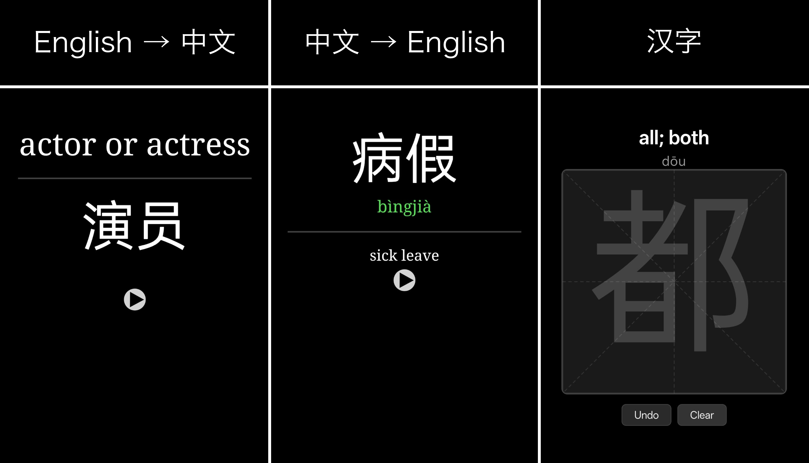

# Hànki

Anki card templates for learning Mandarin Chinese, with handwriting practice.

## Installation

1. Create a note type with fields: English, Pinyin, Hanzi, Sound, Note
2. Add the card types from `card_types/`. These are inspired by the Refold Mandarin deck.
3. Install the [Chinese Support 3 add-on](https://ankiweb.net/shared/info/1752008591).
4. When adding cards, type the Hanzi and press Tab. The add-on will auto-fill Pinyin, English, and Sound.

## Card Types

### zh2en

Chinese → English recall. Front shows Hanzi (tap to reveal pinyin); back shows pinyin, English, audio, and optional notes.

### en2zh

English → Chinese recall. Front shows English and optional notes; back shows Hanzi (tap to reveal pinyin) and audio.

### hanzi

Handwriting practice. Front shows English + pinyin with a drawing canvas (米字格 grid). Back shows the character within the canvas. Both sides support undo and clear.

## Features

- **Dark/light mode:** all card types adapt automatically
- **Tap to reveal pinyin**
- **Handwriting canvas:** 米字格 grid with undo and clear
