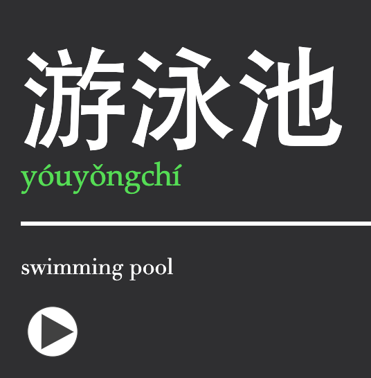

# Mandarin Anki Deck

Type a card’s Hanzi while the 汉字 button is enabled and the add-on will auto-fill English, Pinyin, Color, and Sound.

## Installation
1) Install [Chinese Support 3 add-on](https://ankiweb.net/shared/info/1752008591)
2) Create a note type with fields: English, Pinyin, Hanzi, Sound, Note, Color
3) Add the two card types from `card_types/zh2en` and `card_types/en2zh`. These are inspired by the Refold Mandarin deck.
   - zh2en: Front shows Hanzi with hover pinyin; back shows pinyin + English + audio.
   - en2zh: Front shows English; back shows Hanzi with hover pinyin + audio.
